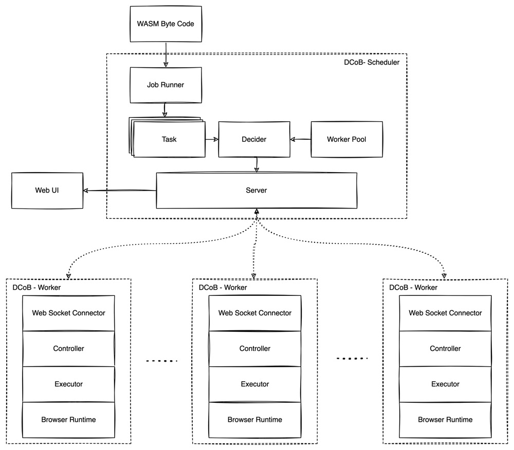
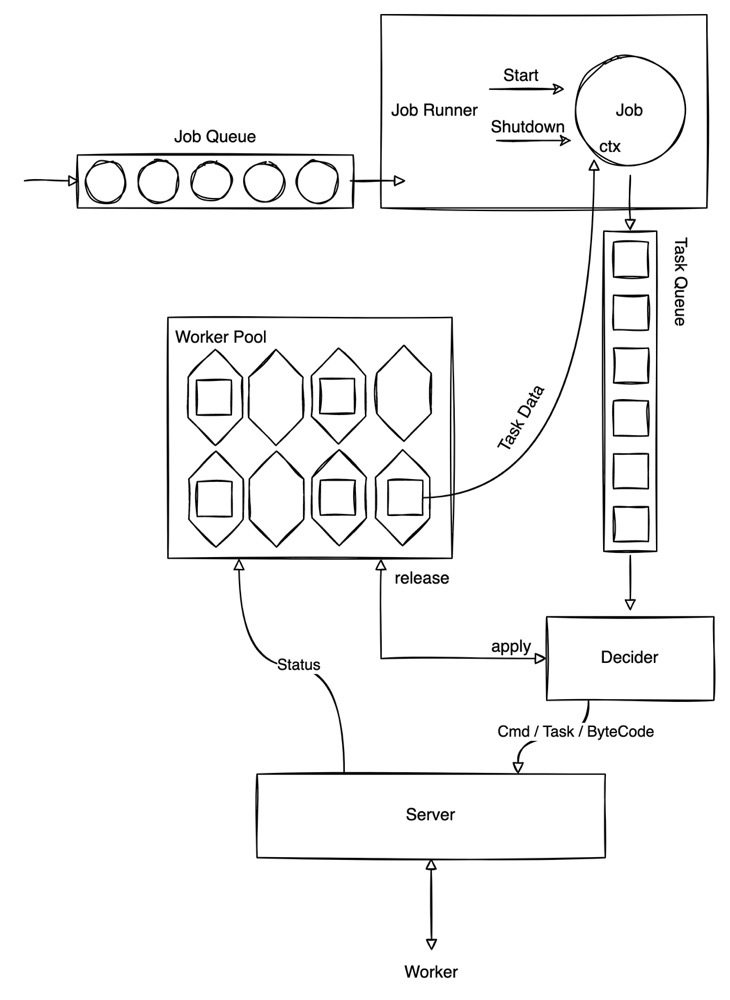

### Job
We define job as some kind of computing process.

The qualified job should:
- CPU intensive, not IO intensive
- Can be easily spilt into many small independent or weakly relevant tasks, which can distribute to workers.
- Currently, we give two jobs for demo:
  - compute sha256 and try to find first n bits of zero (like difficulty in POW algorithm)
  - use monte carlo algorithm to calculate pi

### Task
Task is one piece of job, each task should be executed on one worker.

Task abstraction should contain:
- task id
- context: stage initial / intermediate / final data
- function: stateful or stateless procedure that can take input and return output.
    - func id
    - control handler: responsible for start / stop / retry / interrupt

### About WASM
Every mainstream program language can be compiled to WASM code, and thanks to browser manufacture, we can run WASM code (dynamically) on many browsers.

The main logic of worker now is written by Golang and compile to WASM, but most of the worker operation actually achieved by call js lib from golang (this is weired).

The real purpose of introducing WASM is try to let it run task effectively, and the demo job "calculate pi" is indeed send WASM byte stream to worker to run (although there's still some incompatible issues).

### Resource
Workers (browsers) have those characteristics:
- Unstable: to avoid our task affect the normal user browse, worker's process priority is relatively lower.
- Volatile: task can be killed with user close their browser.
- Homogeneous: no matter user's operating system, CPU architecture, browser type, all tasks running on WASM VM.

## Architecture


## Modules Design
### Scheduler


1. Job: contains job meta and context
- Job Spilterator: spilt job to tasks and can be called iteratively to get one task
2. Task Q:
- queue
3. Worker Pool:
- manage worker's lifecycle
- monitor workers status
4. Decider:
- pop task from task q
- apply some workers from worker pool
- decide how to assign tasks to workers (by some policy)
5. Distributer:
- distribute task to worker
- send cmd (start / stop / retry / interrupt) to worker

### Worker
```
                                           
                                           
    Status                  Cmd Task       
      ^                        |           
      |                        |           
      |                        |           
------|------------------------|-----------
      |                        |           
      |                        v           
 +-------------------------------------+   
 |                                     |   
 |                                     |   
 |             Connector               |   
 |                                     |   
 +-------------------------------|-----+   
        ^                        |         
        |                        |         
 +------|-----+           +------v-----+   
 |            |           |            |   
 |  Monitor   <-----------| Controller |   
 |            |           |            |   
 +------------+           +------^-----+   
                                 |         
                                 |         
                                 |         
                                 |         
                          +------v-----+   
                          |            |   
                          |  Executor  |   
                          |            |   
                          +------------+   
```

1. Connector:

- maintain connection status
- register, cancellation

2. Controller:

- assign task to executor
- start / stop / retry / interrupt
- gathering status / result

3. Executor:

- run task

4. Monitor:

- heartbeat / lease
- task status
- task result

### Demo

This demo will try to mine simple virtual coins

#### reference

> https://github.com/dockersamples/dockercoins
